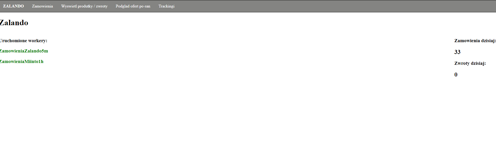
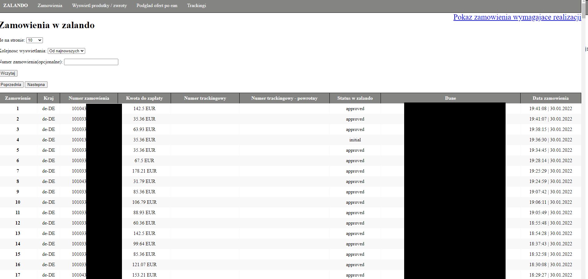
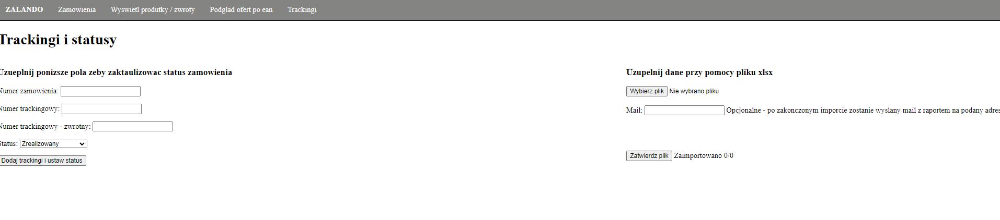
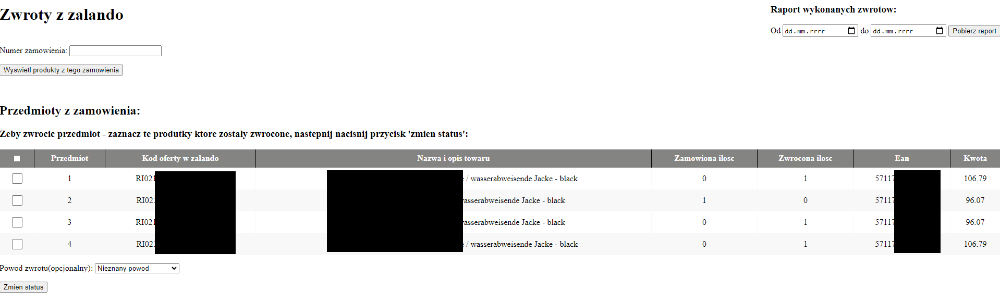
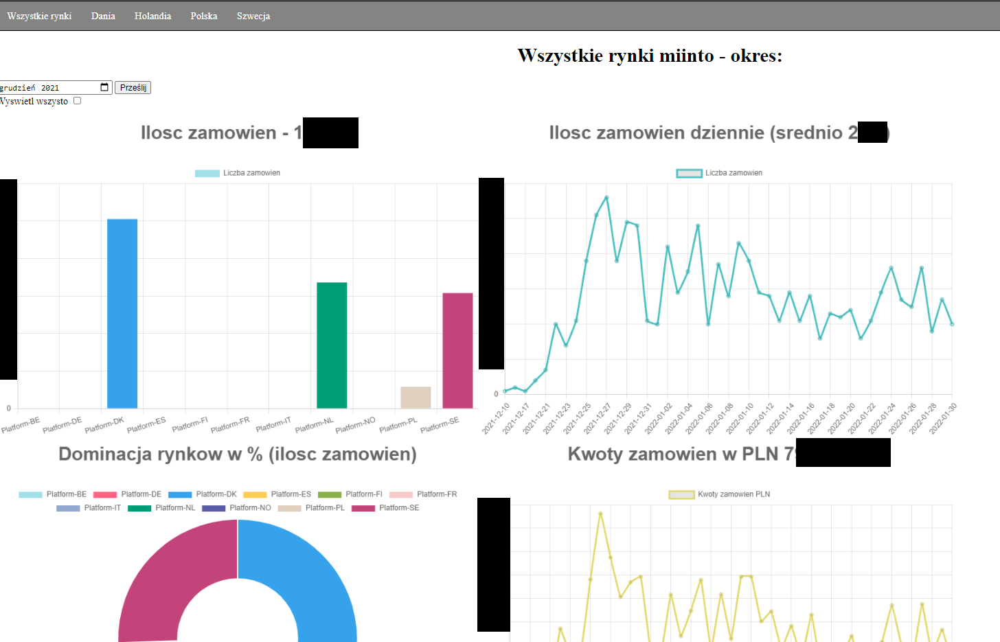
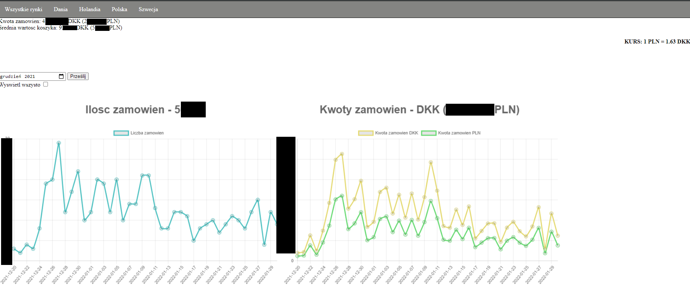

# Zalando-miintoAPI

## Launch
- Create virutal enviroment: ```python3 -m venv```
- Starting virtual eviroment: Windows: ```venv\Scripts\activate.bat```; Linux: ```source venv\Scripts\activate```
- Installing libraries: ```pip install -r requirements.txt```
- In file pw.yaml paste tokens and password like in pw-example.yaml
- Starting app: ```python3 zalandoApi.py```

## Technologies
- Uses python 3
- Is built on the Flask framework, it works with SQLite.
- Uses threading
- Uses rest api and the request library
- Uses datetime for time comparison / reporting
- Uses json datas and simple graphql templates
- Uses html/css
- Uses jinja2 with flask routes
- Supports .txt, yaml and xlsx files

## Introduction 
The program is designed to perform simple integration tasks on the zalando and miinto marketplace platforms. The application consists of two smaller ones. To zalando (mainly in zalandoApi.py) and to miinto in the /miinto/ directory. The application is built on the flask framework and a large part is communication via api. The main part are "workers" which collect orders cyclically and save them to the database.

## Description 
### Zalando
All requests that are sent to the zalando api are located in the zalando_calls.py and uses request function from zalando_requests.py. Are controlled by app.route in zalandoApi.py. Zalando orders and returns are saved to the SQLite database, the tables are in the data_base_objects.py file. Zalando has support for the authorization and token expiration system. Saves files with the token and expiration date to .txt. When executing the request, it is verified whether the token is up-to-date

"Workers" are created using the code in the workers.py file, the list of active "workers" names can be found in the url "/". 



For the Zalando integration, order displaying is directly from api (not from the database). You can sort by date of creation, or display a single order - where more detailed information about the order will be displayed (url "/orders")



For orders with zalando, it is possible to change the status and add tracking numbers via the application. The function of adding tracking using the xlsx file has also been implemented - in this case a worker is created that uploads information due to the rate limit of zalando api



One of the more extensive options is the ability to change the product data in the order to "returned". The given products are displayed for each order, we can choose which one we want to return


The zalando application has several other properties, e.g. blocking offers or displaying details of offers from the account.

### Miinto
The main task of this part of the application is to provide statistics on orders over time - miinto does not have a panel for this. File are in "/miinto/" directory. The miinto_request .py file contains code elements for the authorization and request sending . A separate function has been created for this because miinto requires a signature which will differ depending on the method or parameters. miintoApi.py contains, among others, workers who downloads orders and saves them to the database - it is handled in the same way as zalando, through the workers.py file.


Unlike zalando, order statistics are taken directly from the database. For this integration, a currency converter (online free api) has been implemented in order to obtain statistics on prices in PLN.
For miinto integration, it is possible to display statistics from individual available countries, as follows:



